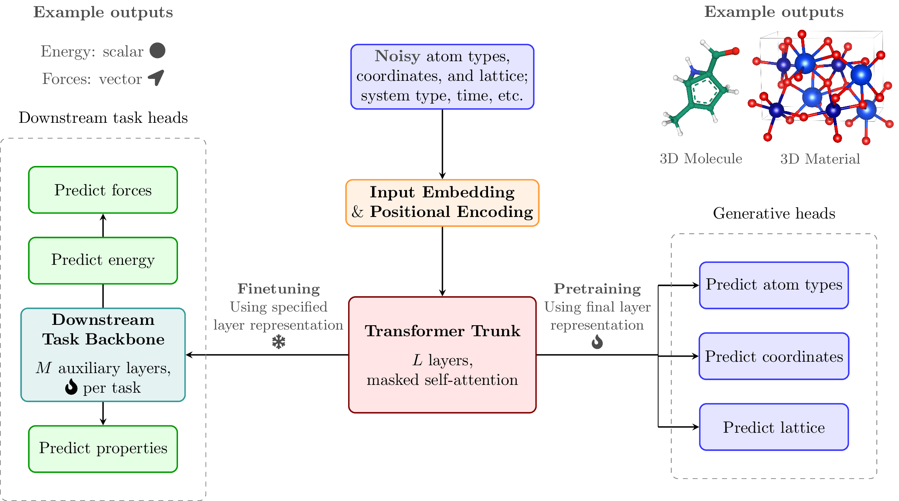

<div align="center">

# Zatom-1

<a href="https://pytorch.org/get-started/locally/"></a>
<a href="https://pytorchlightning.ai/"></a>
<a href="https://hydra.cc/"></a>

<!-- <a href="https://github.com/ashleve/lightning-hydra-template"></a><br> -->

<!-- [](https://papers.nips.cc/paper/2020) -->



</div>

## Description

Official repository of Zatom-1, a multimodal flow foundation model for 3D molecules and materials

## Installation

<details>

> 💡 Note: Make sure to create a `.env` file, for which you can reference `.env.example` as an example.

### Default

<details>

> 💡 Note: We recommend installing `zatom` in a clean Python environment, using `conda` or otherwise.

For example, to install `conda`, one can use the following commands.

```bash
wget "https://github.com/conda-forge/miniforge/releases/download/25.3.1-0/Miniforge3-$(uname)-$(uname -m).sh"
bash Miniforge3-$(uname)-$(uname -m).sh  # accept all terms and install to the default location
rm Miniforge3-$(uname)-$(uname -m).sh  # (optionally) remove installer after using it
source ~/.bashrc  # or `source ~/.zshrc` - alternatively, one can restart their shell session to achieve the same result
```

With `conda` available, one can build a virtual environment for `zatom`.

> 💡 Note: Make sure Git LFS is installed beforehand (https://git-lfs.com/).

#### Linux

```bash
# Clone project
git clone https://ANONYMOUS.ORG/zatom
cd zatom

# [OPTIONAL] Create Conda environment
conda create -n zatom -c conda-forge python=3.10 gcc=11.4.0 gxx=11.4.0 libstdcxx=14.1.0 libstdcxx-ng=14.1.0 libgcc=14.1.0 libgcc-ng=14.1.0 compilers=1.5.2 libconeangle=0.1.1
conda activate zatom

# Install requirements
pip install -e '.[cuda]'

# [OPTIONAL] Install pre-commit hooks
pre-commit install
```

> If run into GLIBC incompatibility issues on SLURM, most likely caused by `torch-scatter`, we recommend the following:
>
> ```bash
> $ module avail gcc
> $ module load GCC/12.2.0
> $ conda uninstall torch-scatter
> $ pip uninstall torch-scatter
> $ pip install torch-scatter --no-binary torch-scatter --no-cache-dir --no-build-isolation
> ```
>
> This installs the source tarball and compiles it locally, linking against your cluster's GLIBC.

#### macOS

```bash
# Clone project
git clone https://ANONYMOUS.ORG/zatom
cd zatom

# [OPTIONAL] Create Conda environment
conda create -n zatom -c conda-forge python=3.10 clang=18 clangxx=18 libcxx=18 libcxx-devel=18 libgfortran5=15.1.0 lld=20.1.7 pybind11=3.0.0 libconeangle=0.1.1
conda activate zatom

# Install `pyeqeq`
export CC=clang
export CXX=clang++
pip install --no-build-isolation pyeqeq

# Install requirements
pip install -e .

# Install Triton with CPU support
cd forks/
git clone https://github.com/triton-lang/triton-cpu.git
cd triton-cpu/
git checkout e60f448f8f197073b75d6d3e77347414a5db3ee7
git submodule update --init --recursive
pip install -r python/requirements.txt
pip install -e python
cd ../../

# [OPTIONAL] Install pre-commit hooks
pre-commit install
```

> 💡 Note: Make sure to install `triton` via the [`triton-cpu`](https://github.com/triton-lang/triton-cpu?tab=readme-ov-file#install-from-source) fork if you want to use/debug Triton-based runtime optimizations on macOS. This fork requires you to run `git submodule sync` and `git submodule update --init --recursive -j 8` in its root directory before using `pip` to install it from source.

### `uv`

You can also set up the environment via `uv`. You can find installation instructions [here](https://docs.astral.sh/uv/).

```
uv venv
source .venv/bin/activate
uv pip install -e .
```

> 💡 Note: To install `zatom` with `uv` on a Windows or macOS-based system, remove the `torch-scatter` installation links in `pyproject.toml` for these platforms before running `uv pip install -e .`.

### Docker

For sake of reproducibility, one can alternatively build a (CUDA-based) Docker image for `zatom`.

```bash
# Clone project, making sure Git LFS is installed beforehand (https://git-lfs.com/)
git clone https://ANONYMOUS.ORG/zatom
cd zatom

# E.g., to build image on local machine
docker build --platform linux/amd64 --no-cache -t zatom:0.0.1 - < Dockerfile
```

> 💡 Note: The Docker image is ~30 GB in size. Make sure you have enough storage space beforehand to build it.

</details>

### Checkpoints

<details>

One can download pretrained/finetuned Zatom-1 checkpoints as needed.

> 💡 Note: The `_pretraining` checkpoints contain both the EMA and non-EMA versions of the generative modeling weights.

```bash
mkdir checkpoints/

wget -P checkpoints/ https://ANONYMOUS.ORG/zatom_1_joint_paper_weights.ckpt
wget -P checkpoints/ https://ANONYMOUS.ORG/zatom_1_joint_mat_prop_paper_weights.ckpt

wget -P checkpoints/ https://ANONYMOUS.ORG/zatom_1_joint_pretraining_paper_weights.ckpt
wget -P checkpoints/ https://ANONYMOUS.ORG/zatom_1_l_joint_pretraining_paper_weights.ckpt
wget -P checkpoints/ https://ANONYMOUS.ORG/zatom_1_xl_joint_pretraining_paper_weights.ckpt
wget -P checkpoints/ https://ANONYMOUS.ORG/zatom_1_wd_joint_pretraining_paper_weights.ckpt

wget -P checkpoints/ https://ANONYMOUS.ORG/platom_1_qm9_only_pretraining_paper_weights.ckpt
wget -P checkpoints/ https://ANONYMOUS.ORG/zatom_1_mp20_only_pretraining_paper_weights.ckpt
wget -P checkpoints/ https://ANONYMOUS.ORG/zatom_1_qm9_only_pretraining_paper_weights.ckpt

wget -P checkpoints/ https://ANONYMOUS.ORG/zatom_1_joint_geom_pretraining_paper_weights.ckpt
wget -P checkpoints/ https://ANONYMOUS.ORG/zatom_1_qmof_only_pretraining_paper_weights.ckpt
wget -P checkpoints/ https://ANONYMOUS.ORG/zatom_1_omol25_only_pretraining_paper_weights.ckpt
wget -P checkpoints/ https://ANONYMOUS.ORG/zatom_1_omol25_only_mlip_pretraining_paper_weights.ckpt
wget -P checkpoints/ https://ANONYMOUS.ORG/zatom_1_omol25_pretrained_and_finetuned_mlip_paper_weights.ckpt

wget -P checkpoints/ https://ANONYMOUS.ORG/zatom_1_joint_mol_prop_pred_paper_weights.ckpt
wget -P checkpoints/ https://ANONYMOUS.ORG/zatom_1_non_pretrained_mol_prop_pred_paper_weights.ckpt
wget -P checkpoints/ https://ANONYMOUS.ORG/zatom_1_qm9_only_mol_prop_pred_paper_weights.ckpt
wget -P checkpoints/ https://ANONYMOUS.ORG/zatom_1_joint_k25_layer_mol_prop_pred_paper_weights.ckpt
wget -P checkpoints/ https://ANONYMOUS.ORG/zatom_1_joint_mid_layer_mol_prop_pred_paper_weights.ckpt
wget -P checkpoints/ https://ANONYMOUS.ORG/zatom_1_joint_k75_layer_mol_prop_pred_paper_weights.ckpt
wget -P checkpoints/ https://ANONYMOUS.ORG/zatom_1_xl_joint_mol_prop_pred_paper_weights.ckpt

wget -P checkpoints/ https://ANONYMOUS.ORG/zatom_1_joint_mol_and_mat_prop_pred_paper_weights.ckpt
wget -P checkpoints/ https://ANONYMOUS.ORG/zatom_1_qm9_only_mol_and_mat_prop_pred_paper_weights.ckpt

wget -P checkpoints/ https://ANONYMOUS.ORG/zatom_1_joint_paper_weights_equal_mol_mat_training_set_ratio.ckpt
```

</details>

</details>

## Training

<details>

Download datasets from Hugging Face

```bash
# Download a single dataset
python zatom/data/download_data.py --dataset qm9

# Download all Zatom datasets (recommended)
python zatom/data/download_data.py --dataset all
```

> By default, all datasets are downloaded to 'data/'. This can be changed in `zatom/data/download_data.py`.

Train model with default configuration

> 💡 Note: The first time (only) you run the code, you'll need to uncomment Line 75 (`datamodule.setup()`) of `zatom/train_fm.py` to download each dataset's metadata for subsequent training or evaluation runs.

```bash
# train on CPU
python zatom/train_fm.py trainer=cpu

# train on GPU
python zatom/train_fm.py trainer=gpu

# train on macOS
python zatom/train_fm.py trainer=mps
```

Train model with chosen experiment configuration from [configs/experiment/](configs/experiment/)

```bash
python zatom/train_fm.py experiment=experiment_name.yaml
```

For example, reproduce Zatom-1's default model (pre)training run

```bash
python zatom/train_fm.py experiment=train
```

**Note:** You can override any parameter from the command line like this

```bash
python zatom/train_fm.py trainer.max_epochs=2000 data.datamodule.batch_size.train=8
```

> 💡 Note: See the [VS Code](https://code.visualstudio.com/) runtime configs within [`.vscode/launch.json`](.vscode/launch.json) for full examples of how to locally customize or debug model training. The scripts within [`scripts/ANON/`](scripts/ANON/) additionally describe how to train or evaluate models on a SLURM cluster.

</details>

## Evaluation

<details>

### Generative tasks

<details>

> 💡 Note: Generate a unique ID for each run using `python scripts/generate_id.py`.

To generate Zatom-1's initial evaluation metrics for (QM9) molecule and (MP20) material generation

```bash
python zatom/eval_fm.py ckpt_path=checkpoints/zatom_1_joint_paper_weights.ckpt model.sampling.num_samples=10000 model.sampling.batch_size=1000 name=eval_tft_80M_QM9+MP20_dcz004rv seed=42 trainer=gpu
```

To generate Zatom-1-XL's initial evaluation metrics for (QM9) molecule and (MP20) material generation

```bash
python zatom/eval_fm.py ckpt_path=checkpoints/zatom_1_xl_joint_pretraining_paper_weights.ckpt model/architecture=tft_300M model.sampling.num_samples=10000 model.sampling.batch_size=1000 name=eval_tft_300M_QM9+MP20_kenribcl seed=42 trainer=gpu
```

To generate Platom-1's initial evaluation metrics for (QM9) molecule and (MP20) material generation

```bash
python zatom/eval_fm.py ckpt_path=checkpoints/platom_1_joint_pretraining_paper_weights.ckpt model/architecture=tfp_80M model.sampling.num_samples=10000 model.sampling.batch_size=1000 name=eval_tfp_80M_QM9+MP20_smi1jrl8 seed=42 trainer=gpu
```

To generate Zatom-1's evaluation metrics for (QM9) molecule generation only

```bash
python zatom/eval_fm.py ckpt_path=checkpoints/zatom_1_joint_paper_weights.ckpt data.datamodule.datasets.mp20.proportion=0.0 model.sampling.num_samples=10000 model.sampling.batch_size=1000 name=eval_tft_80M_QM9_myog4xe0 seed=42 trainer=gpu
```

To generate Zatom-1's initial evaluation metrics for (MP20) material generation only

```bash
python zatom/eval_fm.py ckpt_path=checkpoints/zatom_1_joint_paper_weights.ckpt data.datamodule.datasets.qm9.proportion=0.0 model.sampling.num_samples=10000 model.sampling.batch_size=1000 name=eval_tft_80M_MP20_5suq0fu0 seed=42 trainer=gpu
```

To generate Zatom-1's evaluation metrics for (GEOM-Drugs) molecule generation only

```bash
python zatom/eval_fm.py ckpt_path=checkpoints/zatom_1_joint_geom_pretraining_paper_weights.ckpt data.datamodule.datasets.geom.proportion=1.0 data.datamodule.datasets.mp20.proportion=0.0 data.datamodule.datasets.qm9.proportion=0.0 model.sampling.num_samples=10000 model.sampling.batch_size=1000 name=eval_tft_80M_GEOM_l7f5ct7o seed=42 trainer=gpu
```

To generate Zatom-1's evaluation metrics for (QMOF150) material generation only

```bash
python zatom/eval_fm.py ckpt_path=checkpoints/zatom_1_qmof_only_pretraining_paper_weights.ckpt data.datamodule.datasets.mp20.proportion=0.0 data.datamodule.datasets.qm9.proportion=0.0 data.datamodule.datasets.qmof150.proportion=1.0 model.sampling.num_samples=1000 model.sampling.batch_size=100 name=eval_tft_80M_QMOF_s6uzclqf seed=42 trainer=gpu
```

To plot Zatom-1's inference speed results for each dataset

```bash
python scripts/plot_model_speed_results.py --dataset QM9
python scripts/plot_model_speed_results.py --dataset MP20
python scripts/plot_model_speed_results.py --dataset GEOM
```

To plot Zatom-1's parameter scaling results

```bash
python scripts/plot_model_scaling_results.py
```

> 💡 Note: Consider using [`Protein Viewer`](https://marketplace.visualstudio.com/items?itemName=ArianJamasb.protein-viewer) for VS Code to visualize molecules and using [`VESTA`](https://jp-minerals.org/vesta/en/) locally to visualize materials. Running [`PyMOL`](https://www.pymol.org/) locally may also be useful for aligning/comparing two molecules.

</details>

### Predictive tasks

<details>

To evaluate Zatom-1's (QM9) molecule property predictions with QM9-only finetuning

```bash
# Use seeds 42, 43, and 44 and then run `scripts/group_analyze_csv_metrics.py` with `--keep_only_last_row` to reproduce paper statistics
python zatom/eval_fm.py ckpt_path=checkpoints/zatom_1_joint_paper_weights.ckpt data.datamodule.batch_size.train=128 data.datamodule.batch_size.val=128 data.datamodule.batch_size.test=128 data.datamodule.datasets.mp20.proportion=0.0 data.datamodule.datasets.qm9.proportion=1.0 data.datamodule.datasets.qm9.global_property="[mu,alpha,homo,lumo,gap,r2,zpve,U0,U,H,G,Cv,U0_atom,U_atom,H_atom,G_atom,A,B,C]" logger=csv model.architecture.num_aux_layers=4 model.architecture.num_aux_mlip_layers=8 model.architecture.aux_mlip_hidden_size=1024 model.architecture.atom_types_interpolant.path_t_min=0.98 model.architecture.pos_interpolant.path_t_min=0.98 model.architecture.frac_coords_interpolant.path_t_min=0.98 model.architecture.lengths_scaled_interpolant.path_t_min=0.98 model.architecture.angles_radians_interpolant.path_t_min=0.98 model.sampling.num_samples=1 model.sampling.batch_size=1 name=eval_tft_80M_QM9-prop-pred_7g4rg14y seed=42 trainer=gpu
```

To evaluate Zatom-1's zero-shot (Matbench) material property predictions with QM9-only finetuning

```bash
# Use seeds 42, 43, and 44 and then run `scripts/group_analyze_csv_metrics.py` with `--keep_only_last_row` to reproduce paper statistics
python zatom/eval_fm.py ckpt_path=checkpoints/zatom_1_joint_paper_weights.ckpt data.datamodule.batch_size.train=128 data.datamodule.batch_size.val=128 data.datamodule.batch_size.test=128 data.datamodule.datasets.matbench.proportion=1.0 data.datamodule.datasets.matbench.global_property=matbench_mp_gap data.datamodule.datasets.mp20.proportion=0.0 data.datamodule.datasets.qm9.proportion=0.0 data.datamodule.datasets.qm9.global_property="[mu,alpha,homo,lumo,gap,r2,zpve,U0,U,H,G,Cv,U0_atom,U_atom,H_atom,G_atom,A,B,C]" logger=csv model.architecture.num_aux_layers=4 model.architecture.num_aux_mlip_layers=8 model.architecture.aux_mlip_hidden_size=1024 model.architecture.atom_types_interpolant.path_t_min=0.98 model.architecture.pos_interpolant.path_t_min=0.98 model.architecture.frac_coords_interpolant.path_t_min=0.98 model.architecture.lengths_scaled_interpolant.path_t_min=0.98 model.architecture.angles_radians_interpolant.path_t_min=0.98 model.sampling.num_samples=1 model.sampling.batch_size=1 name=eval_tft_80M_QM9-prop-pred_xyaqjgvx seed=42 trainer=gpu
```

To evaluate Zatom-1's (QM9) molecule and (Matbench) material property predictions with joint QM9-Matbench finetuning

```bash
# Use seeds 42, 43, and 44 and then run `scripts/group_analyze_csv_metrics.py` with `--keep_only_last_row` to reproduce paper statistics
python zatom/eval_fm.py ckpt_path=checkpoints/zatom_1_joint_mat_prop_paper_weights.ckpt data.datamodule.batch_size.train=32 data.datamodule.batch_size.val=32 data.datamodule.batch_size.test=32 data.datamodule.datasets.matbench.proportion=1.0 data.datamodule.datasets.matbench.global_property=matbench_mp_gap data.datamodule.datasets.mp20.proportion=0.0 data.datamodule.datasets.qm9.proportion=1.0 data.datamodule.datasets.qm9.global_property="[mu,alpha,homo,lumo,gap,r2,zpve,U0,U,H,G,Cv,U0_atom,U_atom,H_atom,G_atom,A,B,C]" logger=csv model.architecture.num_aux_layers=4 model.architecture.num_aux_mlip_layers=8 model.architecture.aux_mlip_hidden_size=1024 model.architecture.atom_types_interpolant.path_t_min=0.98 model.architecture.pos_interpolant.path_t_min=0.98 model.architecture.frac_coords_interpolant.path_t_min=0.98 model.architecture.lengths_scaled_interpolant.path_t_min=0.98 model.architecture.angles_radians_interpolant.path_t_min=0.98 model.sampling.num_samples=1 model.sampling.batch_size=1 name=eval_tft_80M_QM9-Matbench-prop-pred_0c3kq4qw seed=42 trainer=gpu
```

To evaluate Zatom-1's (OMol25) molecule and (MPtrj) material energy and force predictions with joint OMol25-MPtrj finetuning

```bash
python zatom/eval_fm.py ckpt_path=checkpoints/zatom_1_joint_paper_weights.ckpt data.datamodule.batch_size.train=72 data.datamodule.batch_size.val=72 data.datamodule.batch_size.test=72 data.datamodule.datasets.mp20.proportion=0.0 data.datamodule.datasets.mptrj.proportion=1.0 data.datamodule.datasets.mptrj.global_energy=true data.datamodule.datasets.omol25.proportion=1.0 data.datamodule.datasets.omol25.global_energy=true data.datamodule.datasets.qm9.proportion=0.0 data.datamodule.datasets.qm9.global_property="[mu,alpha,homo,lumo,gap,r2,zpve,U0,U,H,G,Cv,U0_atom,U_atom,H_atom,G_atom,A,B,C]" eval_split=val model.architecture.num_aux_layers=4 model.architecture.num_aux_mlip_layers=8 model.architecture.aux_mlip_hidden_size=1024 model.architecture.multimodal_model.mask_material_coords=false model.sampling.num_samples=1 model.sampling.batch_size=1 name=eval_tft_80M_OMol25-MPtrj-mlip_jb0praq0 seed=42 trainer=gpu
```

</details>

### Samples

<details>

One can download 10,000 materials and molecules sampled with Zatom-1.

- [Materials as CIF files](https://ANONYMOUS.ORG/zatom_1_materials_mp20.zip) (MP20)
- [Molecules as PDB files](https://ANONYMOUS.ORG/zatom_1_molecules_qm9.zip) (QM9)
- [Molecules as PDB files](https://ANONYMOUS.ORG/zatom_1_molecules_geom.zip) (GEOM-Drugs)

If desired, unzip `zatom_1_materials_mp20.zip` and `zatom_1_molecules_qm9.zip` and move `zatom_1_materials_mp20/` and `zatom_1_molecules_qm9/` under the new directory `data/gen_samples/`. One can then analyze Zatom-1's shared latent space for molecules and materials as follows.

```bash
python scripts/plot_embeddings.py
```

</details>

### Materials analysis

<details>

#### LeMat-GenBench

<details>

To fully evaluate one's generated materials, follow the instructions for [LeMat-GenBench](https://github.com/LeMaterial/lemat-genbench)

```bash
# Within a local copy of LeMat-GenBench
uv run scripts/run_benchmarks.py --cifs logs/eval_fm/runs/eval_tft_80M_MP20_izr5qhhf_2025-12-16_20-00-00/mp20_test_0 --config comprehensive_multi_mlip_hull --name tft_80M_MP20_izr5qhhf
```

One can also download Zatom-1's leaderboard-compatible results for LeMat-GenBench.

- [Results for MP20-only Zatom-1](https://ANONYMOUS.ORG/lemat_genbench_mp20_only_zatom_1.zip) (MP20-only Zatom-1)
- [Results for jointly trained Zatom-1](https://ANONYMOUS.ORG/lemat_genbench_jointly_trained_zatom_1.zip) (Jointly trained Zatom-1)
- [Results for jointly trained Zatom-1-L](https://ANONYMOUS.ORG/lemat_genbench_jointly_trained_zatom_1_l.zip) (Jointly trained Zatom-1-L)
- [Results for jointly trained Zatom-1-XL](https://ANONYMOUS.ORG/lemat_genbench_jointly_trained_zatom_1_xl.zip) (Jointly trained Zatom-1-XL)
- [Results for jointly trained Zatom-1-WD](https://ANONYMOUS.ORG/lemat_genbench_jointly_trained_zatom_1_wd.zip) (Jointly trained Zatom-1-WD)
- [Results for jointly trained Zatom-1-WD (Relaxed)](https://zenodo.org/records/18894015/files/lemat_genbench_jointly_trained_zatom_1_wd_relaxed.zip) (Jointly trained Zatom-1-WD (Relaxed))

</details>

</details>

</details>

## For developers

<details>

Set up `pre-commit` (one time only) for automatic code linting and formatting upon each `git commit`

```bash
pre-commit install
```

Manually reformat all files in the project, as desired

```bash
pre-commit run -a
```

</details>

## Acknowledgements

`zatom` builds upon the source code and data from the following projects:

- [all-atom-diffusion-transformer](https://github.com/facebookresearch/all-atom-diffusion-transformer)
- [flow_matching](https://github.com/facebookresearch/flow_matching)
- [flowmm](https://github.com/facebookresearch/flowmm)
- [lemat-genbench](https://github.com/LeMaterial/lemat-genbench)
- [lightning-hydra-template](https://github.com/ashleve/lightning-hydra-template)
- [PlatonicTransformers](https://github.com/niazoys/PlatonicTransformers)
- [ProteinWorkshop](https://github.com/a-r-j/ProteinWorkshop)
- [posebusters](https://github.com/maabuu/posebusters)
- [tabasco](https://github.com/carlosinator/tabasco)

We thank all their contributors and maintainers!

## License

This project is covered under a modified [**BSD License**](LICENSE).

## Copyright

Zatom Copyright (c) 2026.

## Citing this work

If you use the code or data associated with this package or otherwise find this work useful, please cite:

```bibtex
@article{zatom_1_2026,
    title={Zatom-1: A Multimodal Flow Foundation Model for 3D Molecules and Materials},
    author={ANONYMOUS},
    year={2026},
}
```
